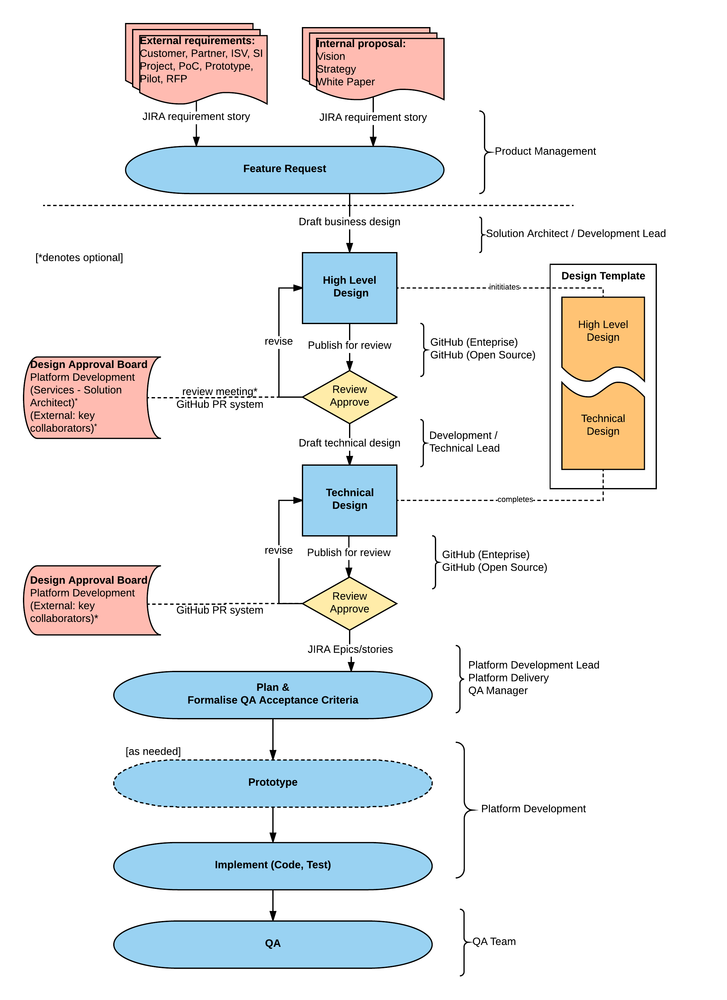

# Design review process

The Corda design review process defines a means of collaborating approving Corda design thinking in a consistent, 
structured, easily accessible and open manner.

The process has several steps:

1. High level discussion with the community and developers on corda-dev.
2. Writing a design doc and submitting it for review via a PR to this directory. See other design docs and the
   design doc template (below).
3. Respond to feedback on the github discussion.
4. You may be invited to a design review board meeting. This is a video conference in which design may be debated in
   real time. Notes will be sent afterwards to corda-dev.
5. When the design is settled it will be approved and can be merged as normal.
   
The following diagram illustrates the process flow:

At least some of the following people will take part in a DRB meeting: 
	
* Richard G Brown (CTO)
* James Carlyle (Chief Engineer)
* Mike Hearn (Lead Platform Engineer)
* Mark Oldfield (Lead Platform Architect)
* Jonathan Sartin (Information Security manager)
* Select external key contributors (directly involved in design process)

The Corda Technical Advisory Committee may also be asked to review a design.

Here's the outline of the design doc template:

.. toctree::

   template/design.md